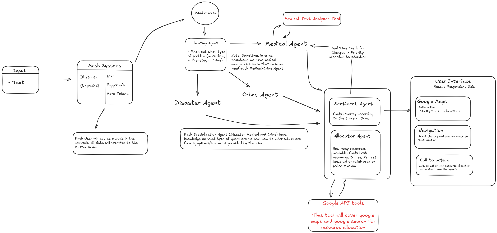

# SwiftCare: AI-Powered Emergency Response System

## 📌 Overview

RescueNet is an **agentic AI-powered emergency response system** designed to improve communication and coordination during **medical, disaster, and crime-related emergencies**. The system leverages a **multi-agent architecture**, **mesh networking**, and **real-time prioritization** to ensure faster, smarter, and more reliable response, even in degraded connectivity environments.

---

## 🚨 Key Features

* **Multi-Modal Input**

  * Accepts both **text** and **voice (TTS/ASR)** input from users in emergencies.

* **Mesh Networking**

  * Users act as **nodes in a mesh network** using Bluetooth/Wi-Fi.
  * Ensures communication continuity even with degraded infrastructure.

* **Routing Agent**

  * Detects the type of emergency (Medical, Disaster, Crime).
  * Routes input to specialized agents.

* **Specialized Agents**

  * **Medical Agent** → integrates a Medical Text Analyzer for health emergencies.
  * **Disaster Agent** → recognizes disaster-related scenarios.
  * **Crime Agent** → handles criminal emergency cases.
  * **Sentiment Agent** → adjusts **priority in real-time** based on severity and transcription.
  * **Allocator Agent** → allocates resources, finds nearest hospitals, relief centers, or police stations.

* **Real-Time UI for Responders**

  * **Interactive Google Maps** with priority tags.
  * **Navigation support** to emergency sites.
  * **Call-to-action prompts** for dispatching resources.

* **Tool Integration**

  * **Google API Tools** → Maps + Search for resource allocation.
  * **Medical Text Analyzer** → Identifies symptoms, severity, and urgency.

---

## 🏗️ System Architecture

---

## 🔁 Agentic Workflow

1. **Sense** → User submits emergency input (text/voice).
2. **Plan** → Routing Agent identifies type + allocates to specialized agents.
3. **Act** → Agents analyze context, allocate resources, and tag priority.
4. **Observe** → Sentiment & Allocator Agents re-check and reprioritize in real-time.

---

## ⚙️ Tech Stack

* **AI/ML:** LLMs for language understanding, sentiment analysis.
* **Networking:** Bluetooth Mesh (degraded), Wi-Fi (high bandwidth).
* **APIs:** Google Maps API, Google Search API, Medical Text Analyzer.
* **Frontend:** Rescue Responder UI (interactive maps, navigation, CTAs).
* **Backend:** Multi-agent orchestration & routing engine.

---

## 🚧 Challenges Solved

* Maintaining **connectivity** in low-network areas via mesh systems.
* **Dynamic prioritization** using Sentiment Agent.
* Handling **multi-modal inputs** (text + voice).
* Balancing **resource allocation** across hospitals, relief areas, and police stations.

---

## 🎯 Accomplishments

* Working prototype tested on **simulated crisis scenarios**.
* **Multi-agent reasoning loop** successfully demonstrated.
* Seamless integration with **Google Maps** for live response coordination.

---

## 🚀 Future Work

* Expand to **multilingual emergency handling**.
* Integrate **drones & IoT devices** for faster ground response.
* Deploy at scale for **disaster-prone rural regions**.

---

## 🧑‍🤝‍🧑 Team

* *Sehat gang*
* Members: *Hamza, Ali, Maaz*

---
